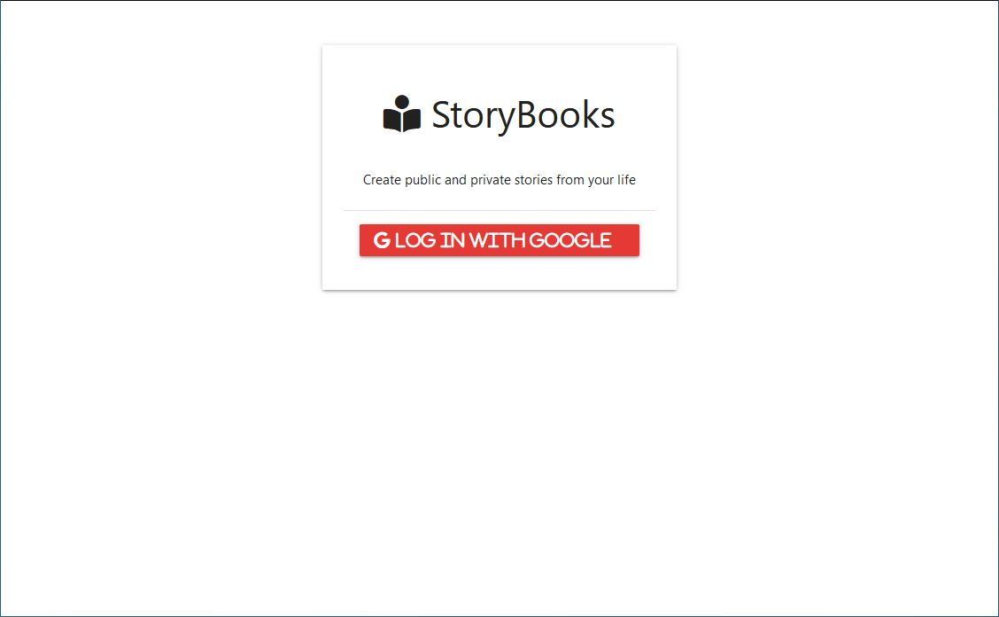
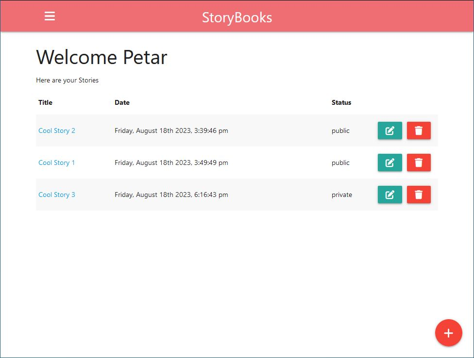
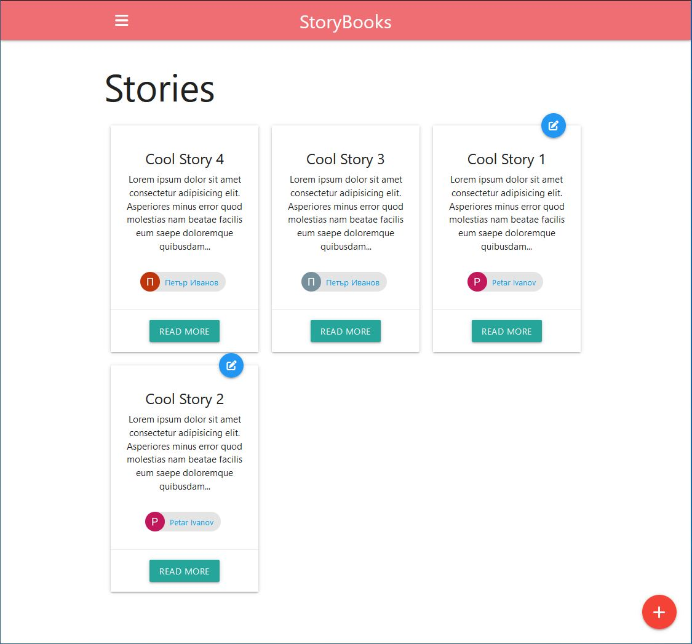
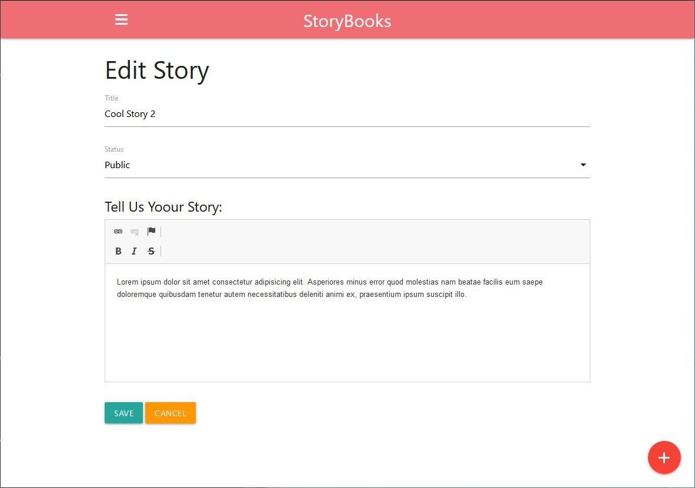
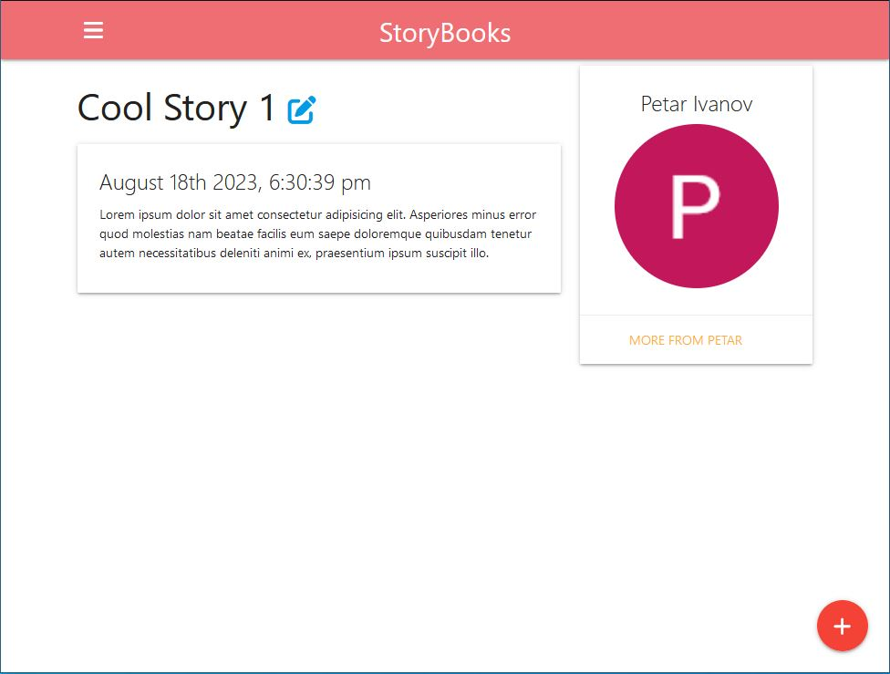

# StoryBooks App Documentation

The StoryBooks app is a web application built using Node.js, Express, MongoDB, Passport with a Google OAuth strategy, and more. This app allows users to create, read, and manage their own storybooks.

## Table of Contents

- [Features](#features)
- [Overview](#overview)
- [Technologies](#technologies)
- [System Requirements](#system-requirements)
- [Installation](#installation)
- [Configuration](#configuration)
- [License](#license)

## Features

- User authentication with Google OAuth: Users can log in using their Google accounts.
- Create Storybooks: Authenticated users can create and write their own storybooks.
- Edit and Delete Stories: Users can edit and delete the stories they've created.
- Public and Private Stories: Users can choose to make their stories public or private.
- Dashboard: Users have access to a dashboard where they can manage their stories.
- View Stories: All users can view public stories created by others.

 ## Overview

Welcome to the StoryBooks app! This web application allows users to create, read, and manage their own storybooks. Here's a visual overview of some of the key features:

### Login with Google View



For seamless and secure access, the app offers the option to log in using your Google account. The Login with Google view presents a familiar Google login interface, ensuring a smooth and trustworthy authentication process.

### Dashboard



This is the Dashboard view, where you can visualize all your personal stories You'll have convenient buttons to create new stories, edit existing ones, and remove stories you no longer need.

### Public Stories View



In the "Public Stories" view, you can explore a variety of stories written by different authors. Click on a story to read more about it and immerse yourself in its content.

### Create and Edit View



In the "Create and Edit" view, you'll see a form that lets you make new stories or edit existing ones. You can add a title, decide if it's public or private, and write your story in a text area. It's where you shape your stories!

### View More



In the "View More" section, you get to take a closer look at a story. It shows you everything: who wrote it, a picture to go with it, and the entire story. 


## Technologies

The StoryBooks app is built using the following technologies and dependencies:

- [Node.js](https://nodejs.org/): JavaScript runtime environment.
- [Express](https://expressjs.com/): Web application framework for Node.js.
- [MongoDB](https://www.mongodb.com/): NoSQL database for data storage.
- [Passport](http://www.passportjs.org/) (with [Google OAuth 2.0 strategy](http://www.passportjs.org/packages/passport-google-oauth20/)): Authentication middleware for Node.js.
- [Express Handlebars](https://github.com/express-handlebars/express-handlebars): Template engine for rendering views.
- [Express Session](https://www.npmjs.com/package/express-session): Session middleware for Express.
- [Connect Mongo](https://github.com/jdesboeufs/connect-mongo): MongoDB session store for Express Session.
- [Method Override](https://www.npmjs.com/package/method-override): Middleware for HTTP method override.
- [Moment.js](https://momentjs.com/): Library for working with dates and times.
- [Mongoose](https://mongoosejs.com/): Object Data Modeling (ODM) library for MongoDB and Node.js.
- [Morgan](https://github.com/expressjs/morgan): HTTP request logger middleware.
- [dotenv](https://github.com/motdotla/dotenv): Loads environment variables from a `.env` file.
- [cross-env](https://github.com/kentcdodds/cross-env) (Development dependency): Sets environment variables cross-platform.
- [Nodemon](https://nodemon.io/) (Development dependency): Monitors for changes and automatically restarts the server.

These technologies and dependencies work together to create a dynamic and feature-rich StoryBooks app.

## System Requirements

To ensure smooth operation of the StoryBooks app, make sure your system meets the following requirements:

- Node.js: Make sure you have Node.js installed on your machine.
- MongoDB: Install and set up MongoDB, and have a MongoDB connection URL ready.
- Google OAuth Credentials: Set up a Google OAuth 2.0 client and obtain client ID and client secret.
  
## Installation

To get started with the StoryBooks app, follow these steps:

1. Clone the repository by running the following command in your terminal:
   
   git clone https://github.com/your-username/storybooks-app.git

2. Navigate to the project's directory:
   
   cd storybooks-app
   
4. Install the project dependencies:
   
   npm install

5. Configure your environment variables as explained in the Configuration section:

6. Start the server:

   npm start
   
## Configuration

Before you start using the StoryBooks app, ensure you set up the required environment variables. These variables contain sensitive information and should not be included in the repository. Here's how to configure them:

1. Create a `.env` file in the root directory of the project.

2. Add the following environment variables to the `.env` file with appropriate values:

   ```dotenv
   PORT=3000
   MONGO_URI=mongodb://your-mongodb-connection-url
   GOOGLE_CLIENT_ID=your-google-client-id
   GOOGLE_CLIENT_SECRET=your-google-client-secret
   SESSION_SECRET=your-session-secret

## License

The StoryBooks app is released under the [MIT License](LICENSE).

Special thanks to Traversy Media for his exceptional tutorials and guidance. The development of this project involved following some of his tutorial steps.
